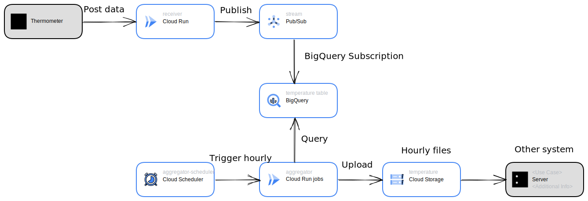

# Temperature Aggregation

## Scenario

The edge themometers can call REST API and its request bodies contain data points of measured
temperature as a JSON like following:

```json
{
  "data": [
    {"timestamp": "2023-02-22T00:00:00Z", "value": "0.0"},
    {"timestamp": "2023-02-22T00:01:00Z", "value": "1.0"},
    {"timestamp": "2023-02-22T00:02:00Z", "value": "2.0"},
    {"timestamp": "2023-02-22T00:03:00Z", "value": "3.0"},
    {"timestamp": "2023-02-22T00:04:00Z", "value": "4.0"}
  ]
}
```

The other system needs these data for a certain process, but it requires hourly files as flatten
JSON lines like:

```json
{"timestamp": "2023-02-22T00:00:00Z", "temperature": 0.0}
{"timestamp": "2023-02-22T00:01:00Z", "temperature": 1.0}
{"timestamp": "2023-02-22T00:02:00Z", "temperature": 2.0}
{"timestamp": "2023-02-22T00:03:00Z", "temperature": 3.0}
{"timestamp": "2023-02-22T00:04:00Z", "temperature": 4.0}
```

To pass such JSON lines files, it needs unpacking and some conversion. What's more, visualizing
temeprature data is demanded.

## Architecture

Solving the scenario:

1. Receiver app on Cloud Run receives measured data from themometers and publishes unpacked, 
   converted data points.
2. Using BigQuery Subscription, BigQuery stores all the data.
3. Aggregator app on Cloud Run jobs makes and uploads hourly files, querying BigQuery, which is
   triggered by Cloud Scheduler.



## Run locally

You need emulators or a actual cloud environment, which you can create with
[terraform](https://github.com/ShawnLabo/TAP/tree/main/go/temperature-aggregation/terraform).

Run receiver.

```sh
cd receiver
PUBSUB_PROJECT_ID="your-project-id" PUBSUB_TOPIC_ID="your-pubsub-topic-id" go run .
```

Post dummy data.

```sh
curl -i localhost:8080/temperature -X POST \
  -d '{
    "data": [
      {"timestamp": "2023-02-22T00:00:00Z", "value": "0.0"},
      {"timestamp": "2023-02-22T01:00:00Z", "value": "1.0"},
      {"timestamp": "2023-02-22T02:00:00Z", "value": "2.0"},
      {"timestamp": "2023-02-22T03:00:00Z", "value": "3.0"},
      {"timestamp": "2023-02-22T04:00:00Z", "value": "4.0"}
    ]
  }'
```

Run aggregator.

```sh
cd aggregator
STORAGE_BUCKET_NAME="" \
  BIGQUERY_PROJECT_ID="" \
  BIGQUERY_DATASET_ID="" \
  BIGQUERY_TABLE_ID="" \
  DATASTORE_PROJECT_ID="" \
  go run .
```

## References

* BigQuery
  * [Specifying a schema  |  BigQuery  |  Google Cloud](https://cloud.google.com/bigquery/docs/schemas#specifying_a_json_schema_file)
* Pub/Sub
  * [Creating and managing schemas  |  Cloud Pub/Sub Documentation  |  Google Cloud](https://cloud.google.com/pubsub/docs/schemas)
  * [BigQuery subscriptions  |  Cloud Pub/Sub Documentation  |  Google Cloud](https://cloud.google.com/pubsub/docs/bigquery)
  * [Specification | Apache Avro](https://avro.apache.org/docs/1.11.1/specification/_print/#schema-declaration)
  * [Create and use subscriptions  |  Cloud Pub/Sub Documentation  |  Google Cloud](https://cloud.google.com/pubsub/docs/create-subscription#assign_bigquery_service_account)
